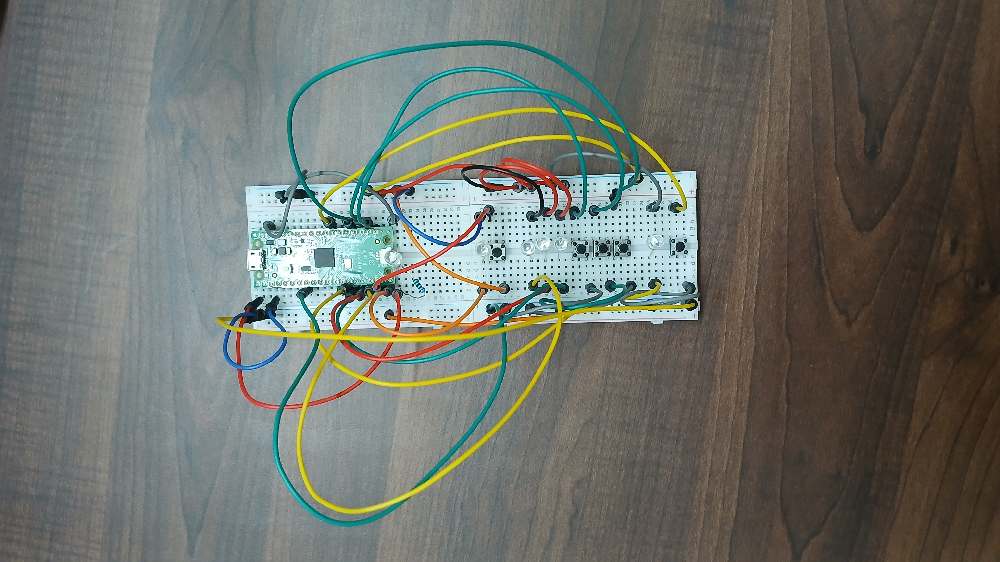

# pico-memory-game
 a memory game made using pico

 (readme not completed, school just started, will do it later.)

buttons:
start button:GPIO 14
reset button:GPIO 22
down button:GPIO 18
middle button:GPIO 19
up button:GPIO 20
leds:
fail led:GPIO 15
led 1:GPIO 13
led 2:GPIO 12
led 3:GPIO 11
win led:GPIO 10
power led:GPIO 0

